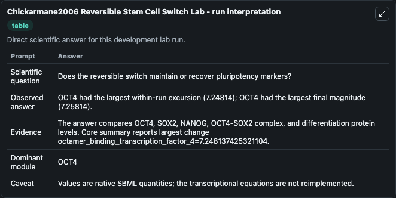
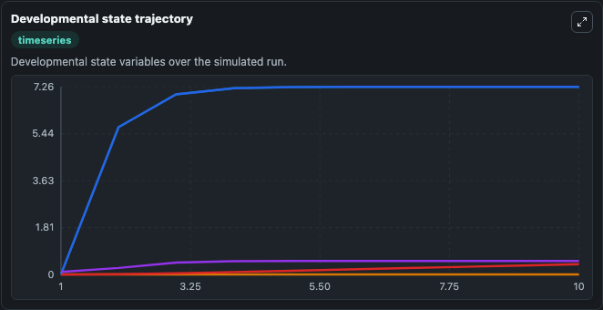
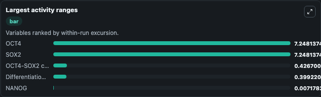
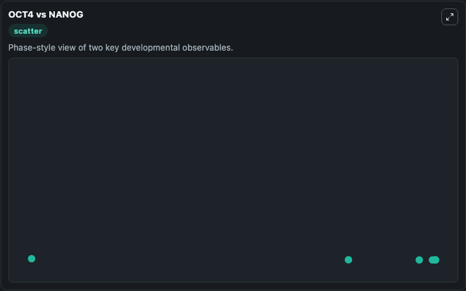

# Chickarmane2006 Reversible Stem Cell Switch Lab

Reversible embryonic stem-cell transcriptional switch executed directly from the bundled SBML source.

Scientific question: Does the reversible switch maintain or recover pluripotency markers?

This lab keeps the bundled SBML file as the scientific source of truth. The core model runs through `TelluriumSBMLBioModule`; friendly outputs map back to raw SBML symbols in `models/core/model.yaml`.

## Controls
The public controls below map to SBML boundary signals or named drug parameters and do not alter the bundled equations.
- `p53_signal` (p53 signal): Sets the fixed p53 boundary signal used by the stem-cell switch reactions. Maps to SBML symbol `p53`.

## What You'll See

This captured run uses the default configuration for Chickarmane2006 Reversible Stem Cell Switch Lab, simulating 10 model-time units with results reported every 1. Public controls include p53 signal; this capture uses the lab defaults from `runtime.initial_inputs`. The visible outputs include OCT4, SOX2, NANOG, OCT4-SOX2 complex, Differentiation protein. The core wrapper uses an internal integration step of 0.1.

<!-- BIOSIMULANT_VISUALS_START -->
### Output Visualizations

The run interpretation table summarizes the completed default run and the main activity changes across the configured outputs.

The developmental state trajectory plots the selected observables over the simulated time course so their dynamics can be compared directly.

The largest activity ranges chart ranks the outputs by how much they varied during the run.

The OCT4 vs NANOG scatter plot compares the two highlighted outputs to show how their simulated trajectories relate to each other.

<!-- BIOSIMULANT_VISUALS_END -->
