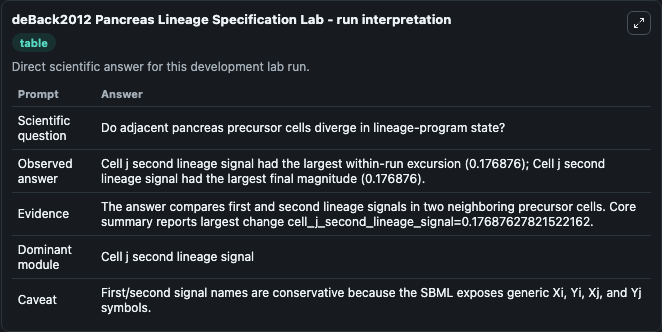
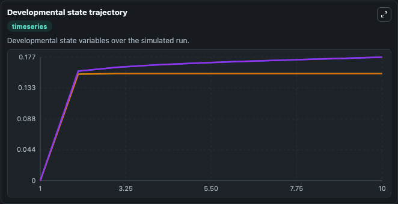
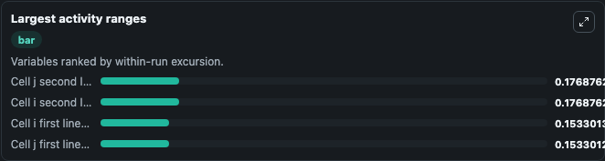
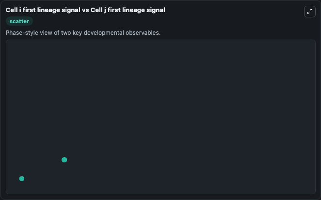

# deBack2012 Pancreas Lineage Specification Lab

Two-cell pancreas endocrine/exocrine lineage specification model executed directly from bundled SBML.

Scientific question: Do adjacent pancreas precursor cells diverge in lineage-program state?

This lab keeps the bundled SBML file as the scientific source of truth. The core model runs through `TelluriumSBMLBioModule`; friendly outputs map back to raw SBML symbols in `models/core/model.yaml`.

## Controls
The public controls below are setup-time initial conditions; they set the starting state before simulation and are not reapplied as clamped inputs during later windows.
- `starting_first_cell_first_fate_signal` (Starting first-cell first-fate signal): Setup-time initial value for the first lineage signal in neighboring cell i. Maps to SBML symbol `species_1` (`Xi`).
- `starting_first_cell_second_fate_signal` (Starting first-cell second-fate signal): Setup-time initial value for the second lineage signal in neighboring cell i. Maps to SBML symbol `species_2` (`Yi`).
- `starting_second_cell_first_fate_signal` (Starting second-cell first-fate signal): Setup-time initial value for the first lineage signal in neighboring cell j. Maps to SBML symbol `species_3` (`Xj`).
- `starting_second_cell_second_fate_signal` (Starting second-cell second-fate signal): Setup-time initial value for the second lineage signal in neighboring cell j. Maps to SBML symbol `species_4` (`Yj`).

## What You'll See

This captured run uses the default configuration for deBack2012 Pancreas Lineage Specification Lab, simulating 10 model-time units with results reported every 1. Public controls include Starting first-cell first-fate signal, Starting first-cell second-fate signal, Starting second-cell first-fate signal, Starting second-cell second-fate signal; this capture uses the lab defaults from `runtime.initial_inputs`. The visible outputs include Cell i first lineage signal, Cell i second lineage signal, Cell j first lineage signal, Cell j second lineage signal. The core wrapper uses an internal integration step of 0.1.

<!-- BIOSIMULANT_VISUALS_START -->
### Output Visualizations

The run interpretation table summarizes the completed default run and the main activity changes across the configured outputs.

The developmental state trajectory plots the selected observables over the simulated time course so their dynamics can be compared directly.

The largest activity ranges chart ranks the outputs by how much they varied during the run.

The Cell i first lineage signal vs Cell j first lineage signal scatter plot compares the two highlighted outputs to show how their simulated trajectories relate to each other.

<!-- BIOSIMULANT_VISUALS_END -->
