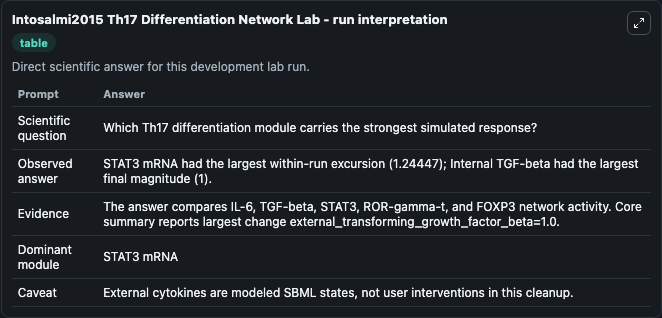
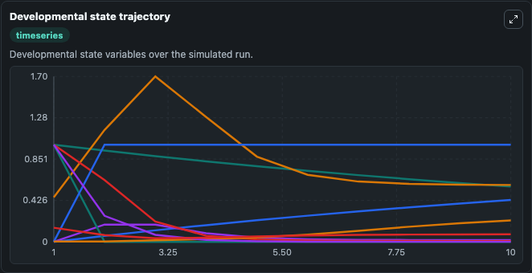
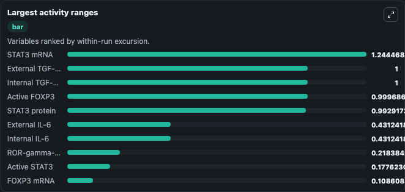
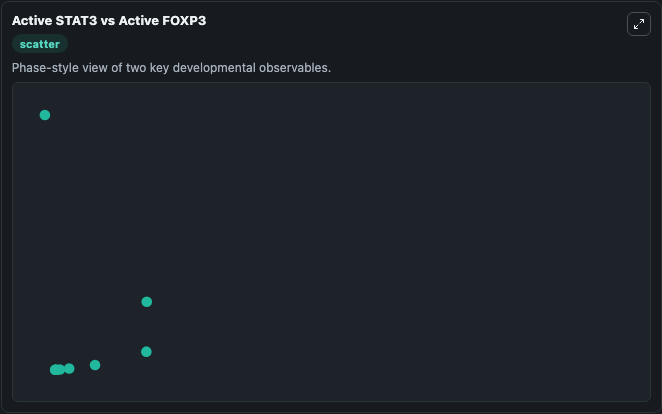

# Intosalmi2015 Th17 Differentiation Network Lab

Core molecular network steering Th17 cell differentiation executed directly from the bundled SBML source.

Scientific question: Which Th17 differentiation module carries the strongest simulated response?

This lab keeps the bundled SBML file as the scientific source of truth. The core model runs through `TelluriumSBMLBioModule`; friendly outputs map back to raw SBML symbols in `models/core/model.yaml`.

## Controls
The public controls below are setup-time initial conditions; they set the starting state before simulation and are not reapplied as clamped inputs during later windows.
- `starting_interleukin_6_signal` (Starting IL-6 signal): Setup-time initial extracellular IL-6 signal for the Th17 network. Maps to SBML symbol `IL6ext`.
- `starting_transforming_growth_factor_beta_signal` (Starting TGF-beta signal): Setup-time initial extracellular TGF-beta signal for the Th17 network. Maps to SBML symbol `TGFbext`.

## What You'll See

This captured run uses the default configuration for Intosalmi2015 Th17 Differentiation Network Lab, simulating 10 model-time units with results reported every 1. Public controls include Starting IL-6 signal, Starting TGF-beta signal; this capture uses the lab defaults from `runtime.initial_inputs`. The visible outputs include External IL-6, Internal IL-6, STAT3 mRNA, Active STAT3, External TGF-beta, and 4 more. The core wrapper uses an internal integration step of 0.1.

<!-- BIOSIMULANT_VISUALS_START -->
### Output Visualizations

The run interpretation table summarizes the completed default run and the main activity changes across the configured outputs.

The developmental state trajectory plots the selected observables over the simulated time course so their dynamics can be compared directly.

The largest activity ranges chart ranks the outputs by how much they varied during the run.

The Active STAT3 vs Active FOXP3 scatter plot compares the two highlighted outputs to show how their simulated trajectories relate to each other.

<!-- BIOSIMULANT_VISUALS_END -->
