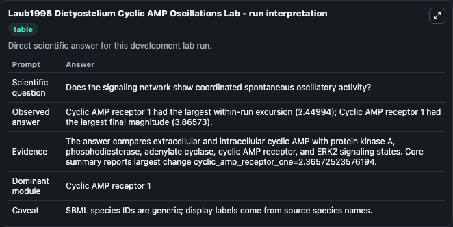
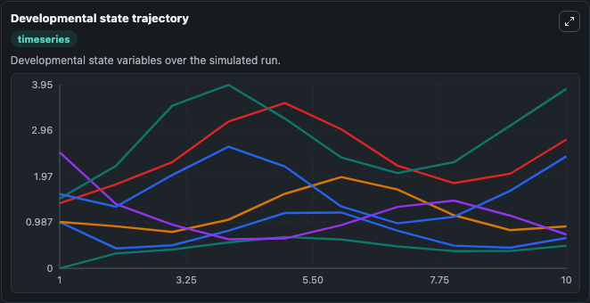
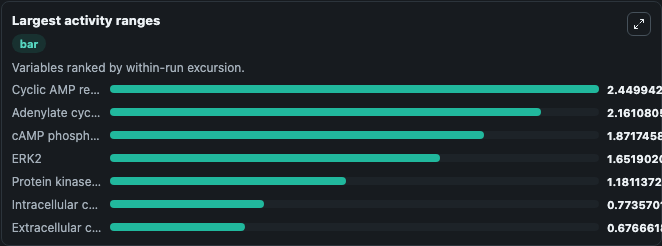
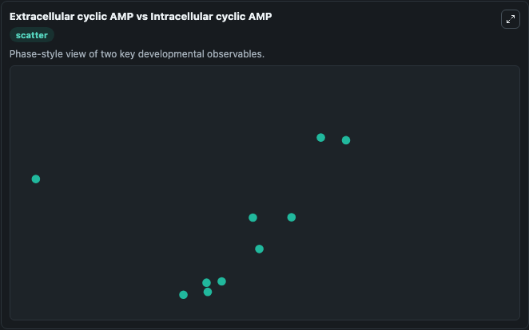

# Laub1998 Dictyostelium cAMP Oscillations Lab

Dictyostelium cAMP signaling oscillator executed directly from the bundled SBML source.

Scientific question: Does the signaling network show coordinated spontaneous oscillatory activity?

This lab keeps the bundled SBML file as the scientific source of truth. The core model runs through `TelluriumSBMLBioModule`; friendly outputs map back to raw SBML symbols in `models/core/model.yaml`.
## Controls
No public controls are exposed. The bundled SBML does not provide a clear external stimulus, treatment, boundary condition, or initial-condition experiment that can be exposed without guessing.

## What You'll See

This captured run uses the default configuration for Laub1998 Dictyostelium Cyclic AMP Oscillations Lab, simulating 10 model-time units with results reported every 1. No public controls are exposed, so the capture runs from the bundled model initial conditions. The visible outputs include Extracellular cyclic AMP, Intracellular cyclic AMP, Protein kinase A activity, cAMP phosphodiesterase REGA, Adenylate cyclase A, and 2 more. The core wrapper uses an internal integration step of 0.1.

<!-- BIOSIMULANT_VISUALS_START -->
### Output Visualizations

The run interpretation table summarizes the completed default run and the main activity changes across the configured outputs.

The developmental state trajectory plots the selected observables over the simulated time course so their dynamics can be compared directly.

The largest activity ranges chart ranks the outputs by how much they varied during the run.

The Extracellular cyclic AMP vs Intracellular cyclic AMP scatter plot compares the two highlighted outputs to show how their simulated trajectories relate to each other.

<!-- BIOSIMULANT_VISUALS_END -->
