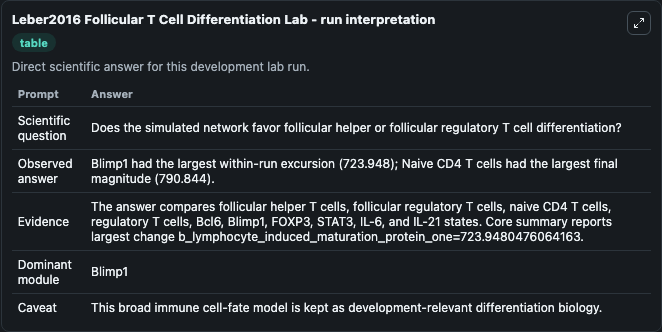
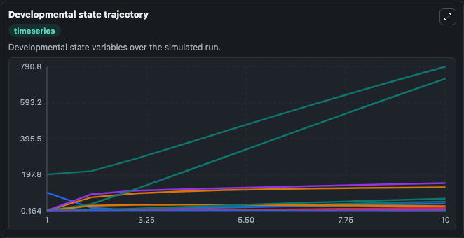
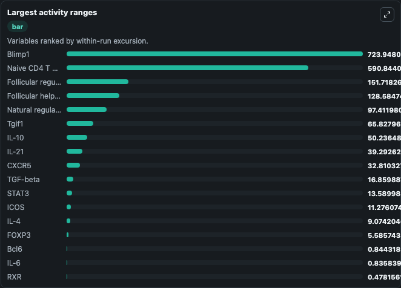
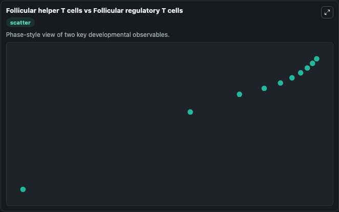

# Leber2016 Tfh Tfr Differentiation Lab

Expanded Tfh/Tfr differentiation model for Helicobacter pylori infection executed directly from bundled SBML.

Scientific question: Does the simulated network favor Tfh or Tfr differentiation?

This lab keeps the bundled SBML file as the scientific source of truth. The core model runs through `TelluriumSBMLBioModule`; friendly outputs map back to raw SBML symbols in `models/core/model.yaml`.

## Controls
The public controls below map to SBML boundary signals or named drug parameters and do not alter the bundled equations.
- `interleukin_2_signal` (IL-2 signal): Sets the constant IL-2 upstream signal in the Tfh/Tfr differentiation network. Maps to SBML symbol `IL2`.
- `stat5_signal` (STAT5 signal): Sets the constant STAT5 upstream signal in the Tfh/Tfr differentiation network. Maps to SBML symbol `STAT5`.

## What You'll See

This captured run uses the default configuration for Leber2016 Follicular T Cell Differentiation Lab, simulating 10 model-time units with results reported every 1. Public controls include IL-2 signal, STAT5 signal; this capture uses the lab defaults from `runtime.initial_inputs`. The visible outputs include Naive CD4 T cells, Natural regulatory T cells, Follicular helper T cells, Follicular regulatory T cells, Bcl6, and 5 more. The core wrapper uses an internal integration step of 0.1.

<!-- BIOSIMULANT_VISUALS_START -->
### Output Visualizations

The run interpretation table summarizes the completed default run and the main activity changes across the configured outputs.

The developmental state trajectory plots the selected observables over the simulated time course so their dynamics can be compared directly.

The largest activity ranges chart ranks the outputs by how much they varied during the run.

The Follicular helper T cells vs Follicular regulatory T cells scatter plot compares the two highlighted outputs to show how their simulated trajectories relate to each other.

<!-- BIOSIMULANT_VISUALS_END -->
