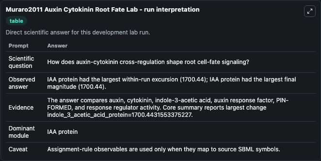
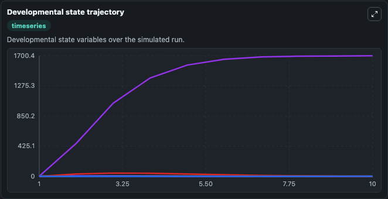
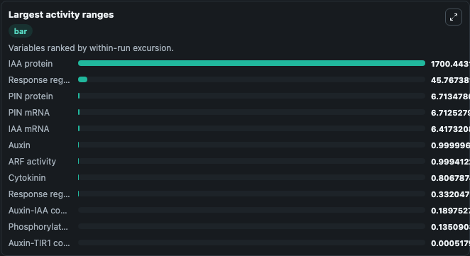
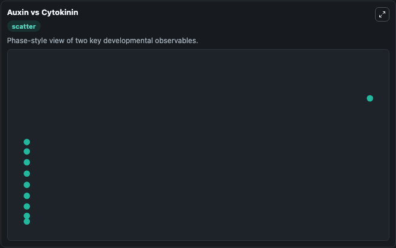

# Muraro2011 Auxin Cytokinin Root Fate Lab

Auxin-cytokinin cross-regulation model for Arabidopsis root cell-fate determination executed directly from SBML.

Scientific question: How does auxin-cytokinin cross-regulation shape root cell-fate signaling?

This lab keeps the bundled SBML file as the scientific source of truth. The core model runs through `TelluriumSBMLBioModule`; friendly outputs map back to raw SBML symbols in `models/core/model.yaml`.

## Controls
The public controls below are setup-time initial conditions; they set the starting state before simulation and are not reapplied as clamped inputs during later windows.
- `starting_auxin_level` (Starting auxin level): Setup-time initial auxin level for the root-fate network. Maps to SBML symbol `Aux`.
- `starting_cytokinin_level` (Starting cytokinin level): Setup-time initial cytokinin level for the root-fate network. Maps to SBML symbol `Ck`.

## What You'll See

This captured run uses the default configuration for Muraro2011 Auxin Cytokinin Root Fate Lab, simulating 10 model-time units with results reported every 1. Public controls include Starting auxin level, Starting cytokinin level; this capture uses the lab defaults from `runtime.initial_inputs`. The visible outputs include Auxin, Cytokinin, IAA mRNA, IAA protein, Auxin-TIR1 complex, and 6 more. The core wrapper uses an internal integration step of 0.1.

<!-- BIOSIMULANT_VISUALS_START -->
### Output Visualizations

The run interpretation table summarizes the completed default run and the main activity changes across the configured outputs.

The developmental state trajectory plots the selected observables over the simulated time course so their dynamics can be compared directly.

The largest activity ranges chart ranks the outputs by how much they varied during the run.

The Auxin vs Cytokinin scatter plot compares the two highlighted outputs to show how their simulated trajectories relate to each other.

<!-- BIOSIMULANT_VISUALS_END -->
