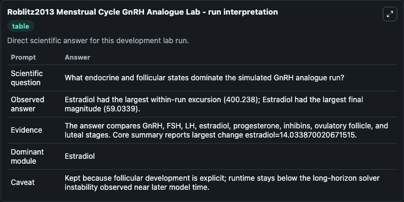
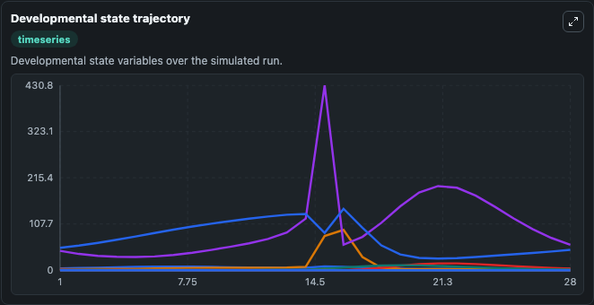
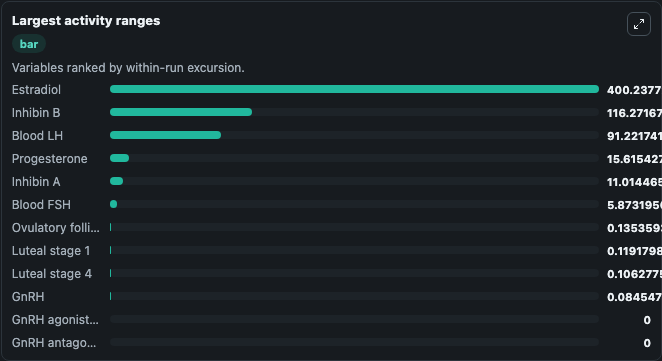
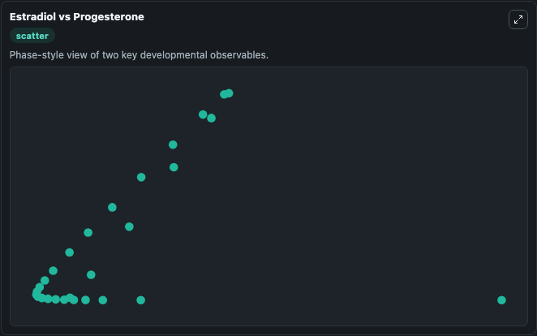

# Roblitz2013 Menstrual Cycle GnRH Analogue Lab

Menstrual-cycle hormone and follicular development model executed directly from the bundled SBML source.

Scientific question: What endocrine and follicular states dominate the simulated GnRH analogue run?

This lab keeps the bundled SBML file as the scientific source of truth. The core model runs through `TelluriumSBMLBioModule`; friendly outputs map back to raw SBML symbols in `models/core/model.yaml`.

## Controls
The public controls below map to SBML boundary signals or named drug parameters and do not alter the bundled equations.
- `gnrh_agonist_dose` (GnRH agonist dose): Sets the named GnRH agonist dose parameter. Maps to SBML parameter `p272` (`dose_Ago`).
- `gnrh_agonist_start_day` (GnRH agonist start day): Sets the named GnRH agonist administration start day. Maps to SBML parameter `p269` (`t_0_Ago`).
- `gnrh_antagonist_dose` (GnRH antagonist dose): Sets the named GnRH antagonist dose parameter. Maps to SBML parameter `p472` (`dose_Ant`).
- `gnrh_antagonist_start_day` (GnRH antagonist start day): Sets the named GnRH antagonist administration start day. Maps to SBML parameter `p469` (`t_0_Ant`).

## What You'll See

This captured run uses the default configuration for Roblitz2013 Menstrual Cycle GnRH Analogue Lab, simulating 28 model-time units with results reported every 1. Public controls include GnRH agonist dose, GnRH agonist start day, GnRH antagonist dose, GnRH antagonist start day; this capture uses the lab defaults from `runtime.initial_inputs`. The visible outputs include GnRH, Blood FSH, Blood LH, Estradiol, Progesterone, and 5 more. The core wrapper uses an internal integration step of 0.25.

<!-- BIOSIMULANT_VISUALS_START -->
### Output Visualizations

The run interpretation table summarizes the completed default run and the main activity changes across the configured outputs.

The developmental state trajectory plots the selected observables over the simulated time course so their dynamics can be compared directly.

The largest activity ranges chart ranks the outputs by how much they varied during the run.

The Estradiol vs Progesterone scatter plot compares the two highlighted outputs to show how their simulated trajectories relate to each other.

<!-- BIOSIMULANT_VISUALS_END -->
