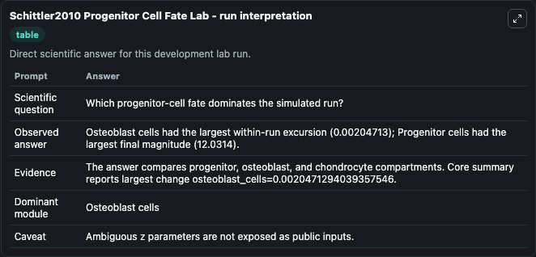
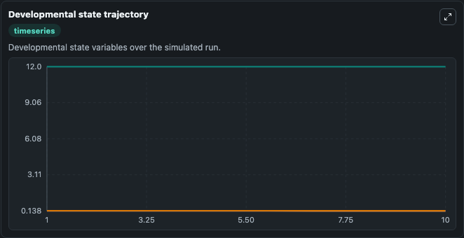
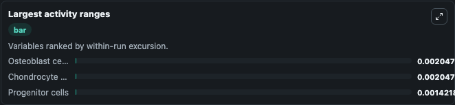
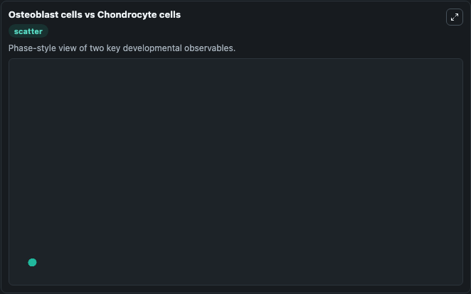

# Schittler2010 Progenitor Cell Fate Lab

Mesenchymal progenitor fate model for osteoblast or chondrocyte differentiation executed directly from SBML.

Scientific question: Which progenitor-cell fate dominates the simulated run?

This lab keeps the bundled SBML file as the scientific source of truth. The core model runs through `TelluriumSBMLBioModule`; friendly outputs map back to raw SBML symbols in `models/core/model.yaml`.

## Controls
The public controls below are setup-time initial conditions; they set the starting state before simulation and are not reapplied as clamped inputs during later windows.
- `starting_progenitor_cells` (Starting progenitor cells): Setup-time initial progenitor-cell state. Maps to SBML symbol `P`.
- `starting_bone_fate_cells` (Starting bone-fate cells): Setup-time initial osteoblast or bone-fate cell state. Maps to SBML symbol `O`.
- `starting_cartilage_fate_cells` (Starting cartilage-fate cells): Setup-time initial chondrocyte or cartilage-fate cell state. Maps to SBML symbol `C`.

## What You'll See

This captured run uses the default configuration for Schittler2010 Progenitor Cell Fate Lab, simulating 10 model-time units with results reported every 1. Public controls include Starting progenitor cells, Starting bone-fate cells, Starting cartilage-fate cells; this capture uses the lab defaults from `runtime.initial_inputs`. The visible outputs include Progenitor cells, Osteoblast cells, Chondrocyte cells. The core wrapper uses an internal integration step of 0.1.

<!-- BIOSIMULANT_VISUALS_START -->
### Output Visualizations

The run interpretation table summarizes the completed default run and the main activity changes across the configured outputs.

The developmental state trajectory plots the selected observables over the simulated time course so their dynamics can be compared directly.

The largest activity ranges chart ranks the outputs by how much they varied during the run.

The Osteoblast cells vs Chondrocyte cells scatter plot compares the two highlighted outputs to show how their simulated trajectories relate to each other.

<!-- BIOSIMULANT_VISUALS_END -->
